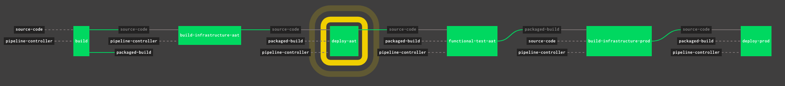

# Netsensia Concourse Pipeline



A Concourse pipeline that creates and manages pipelines for other projects.

## What problems are we solving here?

I have multiple projects within my GitHub organisation, and I want them to share the same deployment pipeline without having to copy and paste the pipeline configuration to each repository.

I want developers to be able to

* Get a deployment pipeline running for an application with close to zero effort
* Add new jobs to an application pipeline in their repository and have the new configuration applied automatically (see [Extending the Pipeline](#ExtendingPipeline))

I want the pipeline to

* Build infrastructure automatically for testing and production environments
* Carry out unit and integration tests
* Perform blue/green deployments with smoke tests
* Determine the environment variables from a vault
* Detect the application framework and deploy accordingly (currently it supports Java and NodeJS)

Assuming an existing Concourse instance has been initialised with this pipeline and configured for a particular GitHub account, all a developer need do is add the name of their project to [repositories.yml](https://github.com/chris-moreton/concourse-pipeline-controller/blob/master/repositories.yml).

## Using the Pipeline Controller

An application will consist of a PRODUCT and COMPONENT. The product is the overarching system or company name, e.g. "directorzone". The component is the name of the service within the PRODUCT, e.g. "api" or "frontend".

Your repository must be named:

    <product>-<component>

e.g.

    directorzone-api

This must be the name of your GitHub repository.

##### Deployment Key

If your project is not open source, you will need to add a deployment key to your repository. Store the key in the following location in CredHub. See [Adding Secrets to CredHub](<https://github.com/chris-moreton/concourse-pipeline-controller/wiki/Adding-Secrets-To-CredHub>) in the wiki for more details on this.

It may be easier to get someone who has the necessary tools installed and/or knows the credentials to authenticate against CredHub.

```
/concourse/main/<product>-<component>/GITHUB_DEPLOY_KEY
```

##### Setting Environment Variables

To set environment variables for your application, add them to CredHub at the following locations:

```
concourse/main/product-component/aat/env
concourse/main/product-component/prod/env
```

Example:

```
credhub set -n concourse/main/directorzone-api/aat/env/PEXELS_AUTH --type value --value ABCDEFG123456
```

##### Add Your Application

Create a pull request, and when your PR is merged, your project will now be included in the pipeline and run through the following steps.

Update [repositories.yml](https://github.com/chris-moreton/concourse-pipeline-controller/blob/master/repositories.yml) to include your project. Included projects must be repositories in the GitHub organisation for which the controller is [configured](<https://github.com/chris-moreton/concourse-pipeline-controller/wiki/Creating-Your-Own-Pipeline-Controller>).

The next time the pipeline job runs, a pipeline will be created for your application with the following stages:

#### Build

This will build and package your application. Your unit tests will be executed in this step.

| Project Type | Build Command                |
| ------------ | ---------------------------- |
| Java         | ./gradlew build              |
| Node         | npm install && npm run build |

#### Build Infrastructure (AAT)

This first time this stage runs, it will create a Cloud Foundry space for your AAT (automated acceptance testing) environment. It will also create any services that you have requested. See [Adding Services To Your Infrastructure](#AddingServices).

You can add your own infrastructure by adding Terraform configurations to your repository. See [Adding  Custom Infrastructure](#AddingInfrastructure).

#### Deploy (AAT)

The deployment step is a [blue/green deployment](https://docs.cloudfoundry.org/devguide/deploy-apps/blue-green.html) to Cloud Foundry which ensures that the new build is ready for use before switching it with the old one.

##### Smoke Test

After pushing the application to a holding area (blue), it will look for a smoketest file at:

    smoketest/smoketest.sh
    
You can place any commands you like in there. Just ensure that the script returns a zero exit code to indicate success.

#### Functional Tests (AAT)

| Project Type | Test Command         |
| ------------ | -------------------- |
| Java         | ./gradlew functional |
| Node         | yarn test:functional |

#### Build Infrastructure (PROD)

This is where the same infrastructure build for AAT is applied in the PROD environment.

#### Deploy (PROD)

Finally, the application is deployed to production in Cloud Foundry using the same process as the deployment to AAT.

You will be able to look at your deployments using the Cloud Foundry CLI.

Assuming you are logged into the Cloud Foundry instance associated with the pipeline controller, you should see your AAT and PROD environments when you run:

```
cf spaces
```

You should see that two spaces have been created:

```
<product>-aat
<product>-prod
```

You'll noticed that the component is not referenced in the space name. This is because all components within the same product will share the same space.

You can view the applications within the space with:

```
cf target -s <product>-<environment>
cf applications
```

And you can view the services, if any, with:

```
cf services
```

<a name="ExtendingPipeline"/>

### Extending the Pipeline

This is an example of how the directorzone-api pipeline was extended to include jobs to:

1) Migrate data from a legacy system

2) Move legacy images into an S3 bucket

3) Load test data into AAT

4) Dump and restore data from and into production


#### Adding Jobs

You can easily add new Concourse jobs to your pipeline which can use resources from the core pipeline as well as their own defined resource.

Simple create the following file:

```
devops/concourse/pipeline.yml
```

And add resource and jobs to it.

In the example below, the pipeline defines a new data-dump resource while also references three resources from the core pipeline.

Behind the scenes, the pipeline controller simply merges the core pipeline with your new resources and jobs, and creates an extended pipeline.

```
---
resources:
- name: data-dump
  type: s3
  source:
    bucket: pipeline-controller-dumps
    region_name: eu-west-2
    versioned_file: ((SQL_DUMP_FILENAME)).tar.gz
    access_key_id: ((pipeline-controller/AWS_ACCESS_KEY_ID))
    secret_access_key: ((pipeline-controller/AWS_SECRET_ACCESS_KEY))
jobs:
- name: restore-database
  public: false
  plan:
    - get: packaged-build
      passed:
        - build-infrastructure-prod
      trigger: false
    - get: pipeline-controller
      trigger: false
    - get: source-code
      trigger: false
    - get: data-dump
      trigger: false
    - task: load-data
      file: source-code/devops/concourse/tasks/load-data.yml
      params:
        DB_HOST: ((prod/DB_HOST))
        DB_NAME: ((prod/DB_NAME))
        DB_USER: ((prod/DB_USER.username))
        DB_PASS: ((prod/DB_USER.password))
```

<a name="AddingServices"/>

#### Adding Services To Your Infrastructure


Full documentation, including how to set up your own pipeline controller, can be found in the [wiki](https://github.com/chris-moreton/concourse-pipeline-controller/wiki/Netsensia-Deployment-Pipeline).

<a name="AddingInfrastructure"/>

#### Adding Custom Infrastructure

## Setting Up A Pipeline Controller

To learn more about how a controller can be configured for a GitHub organisation, please see [Creating Your Own Pipeline Controller](<https://github.com/chris-moreton/concourse-pipeline-controller/wiki/Creating-Your-Own-Pipeline-Controller>) in the project wiki.
